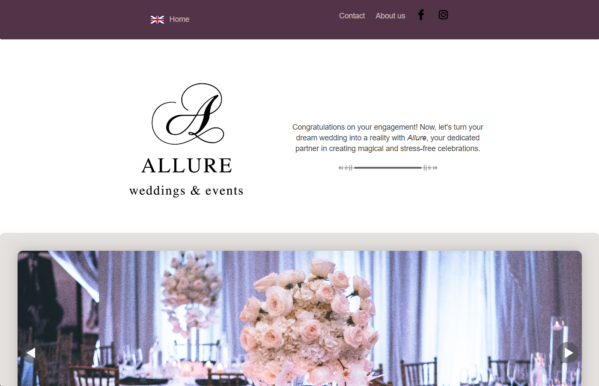

# Description

This GitHub repo is the backend part of the allure website.
Allure is an up-and-comming event organiser start up originating in Croatia. Their emphasis lies in weddings and similar events.

# MVP

The repo consists of the configurations (db connection, port setup, json), error-handling middleware, a model (schema), a route and a readme file. Through the model and route visitors to the website can send queries directly to the two co-founders of the start up.

# To run the code locally:
- clone this repo
- clone the frontend repo as well
In the terminal run:
- npm i, npm i express, npm i mongoose, npm cors, and all other missing dependencies (can be found in the package.json file)
- lastly, npm run dev 

The frontend repo can be found here
https://github.com/ZohraBoukhatem/allure-frontend

# DEMO
https://allureweddings.netlify.app/
